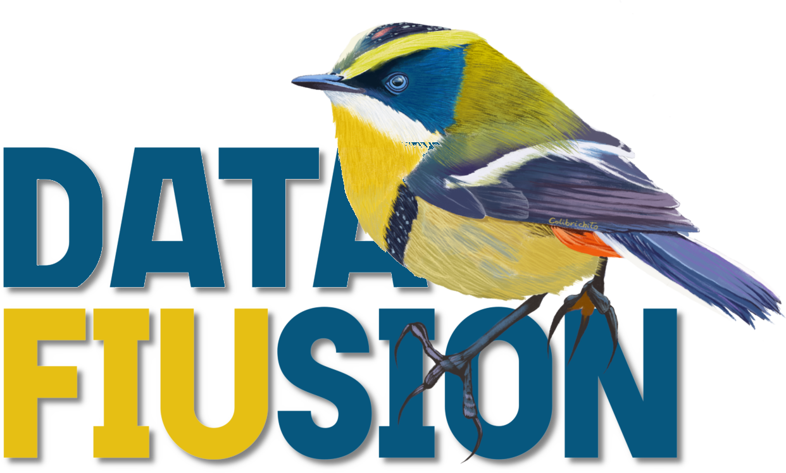

<picture>
  <source media="(prefers-color-scheme: dark)" srcset="siete-colores.png">
  
</picture>

# data-fiusion

Factorización tri-no negativa de matrices dispersas para fusión de datos, siguiendo el
modelo de Zitnik y Zupan (2015). Las matrices de relación se mantienen en
`scipy.sparse` y los factores latentes como arreglos densos de rango bajo.

El objetivo es que el modelo corra sobre relaciones con millones de filas y densidad de
pocos por ciento, donde una implementación que densifica no cabe en memoria. Sobre el
mismo problema, la implementación de referencia densificada usa alrededor de 10 veces
más memoria y entre 2.7 y 5.2 veces más tiempo (`examples/movielens/README.md`).

## Modelo

Una relación $R_{ij}$ de forma $(n_i, n_j)$ se factoriza como

$$R_{ij} \approx G_i\, S_{ij}\, G_j^T$$

con factores no negativos $G_i \in \mathbb{R}_{+}^{n_i \times c_i}$ y backbones
$S_{ij} \in \mathbb{R}^{c_i \times c_j}$ sin restricción de signo. Cada tipo de entidad
aparece en una o más relaciones y su embedding $G_i$ es compartido entre todas ellas,
que es lo que hace que las fuentes se informen entre sí.

## Instalación

El paquete no está publicado en PyPI, así que se instala desde el repositorio
con `uv`:

```bash
uv add "data-fiusion @ git+https://github.com/PLUMAS-research/data-fiusion"
```

Opcional, para el diagrama de relaciones:

```bash
uv add "data-fiusion[viz] @ git+https://github.com/PLUMAS-research/data-fiusion"
```

### GPU

`fuse(..., device="gpu")` corre el loop de ajuste en una GPU CUDA a través de CuPy y
devuelve el modelo en numpy, así que `save`, `transform` y `predict_proba` no cambian.
En sistemas sin GPU no hay que instalar ni configurar nada: el default `device="cpu"`
nunca importa cupy.

```bash
uv add "data-fiusion[gpu] @ git+https://github.com/PLUMAS-research/data-fiusion"
```

- Requiere un driver NVIDIA con soporte CUDA 13 (verificable con `nvidia-smi`). El extra
  resuelve a `cupy-cuda13x[ctk]`, que trae bibliotecas y headers como wheels, así que no
  hace falta un CUDA Toolkit del sistema. Con un driver CUDA 12, instalar
  `cupy-cuda12x[ctk]` en su lugar.
- La librería apunta sola `CUDA_PATH` hacia los wheels NVIDIA (layout `nvidia/cu13/lib`,
  que `cuda-pathfinder` 1.6 no busca por sí solo); si ya está definida, se respeta.
- Datos en `float32`: en GPUs de consumo el `float64` corre a una fracción del `float32`.
  La precisión de trabajo sigue a los datos, igual que en CPU.
- `datafiusion.gpu.available()` dice si el dispositivo es utilizable sin lanzar
  excepciones. Sin soporte todavía: relaciones Poisson y pesos por entrada, que se
  rechazan con un error claro.

Aceleración medida y detalle por primitiva en `examples/gpu/README.md`.

## Uso

```python
import numpy as np
import scipy.sparse as sp
from datafiusion import Relation, fuse

rng = np.random.default_rng(0)
relaciones = {
    "ratings": Relation(src="usuario", dst="pelicula",
                        matrix=sp.random(1000, 500, density=0.05, format="csr")),
    "generos": Relation(src="pelicula", dst="genero",
                        matrix=sp.random(500, 19, density=0.15, format="csr")),
}
modelo = fuse(relaciones, ranks={"usuario": 20, "pelicula": 15, "genero": 10},
             max_iter=200, tol=1e-6)

print(modelo.n_iter, modelo.stop_reason, modelo.rel_error)
```

`fuse` devuelve un `FusionModel` que lleva consigo los factores, los backbones, el
escalado aplicado durante el ajuste y la traza de la pérdida. Ese estado es lo que
permite proyectar entidades nuevas sin que quien llama tenga que recordar en qué
unidades quedó el ajuste.

```python
nuevas = {"ratings": Relation(src="usuario", dst="pelicula", matrix=matriz_nueva)}
derivado = modelo.transform(nuevas, target="usuario")
proba = derivado.predict_proba(target="genero", views=["generos"])
```

## Qué se puede declarar en un ajuste

Cada mecanismo responde una pregunta distinta y todos se combinan, salvo `rows` con
`entry_weights` en la misma relación. Los flujos completos están en
`docs/guia-de-uso.md`.

| Mecanismo | Para qué |
|---|---|
| `relations_from_frames` | Construir todas las relaciones desde tablas largas, con los vocabularios de los tipos compartidos alineados y los desajustes fallando con las categorías nombradas. |
| `Relation.rows` | Declarar qué filas fueron observadas. Sin esto, cada cero es la observación "esta entidad no se relaciona con nada", que es lo que rompe el régimen semi-supervisado. |
| `Relation.entry_weights` y `background` | Bajar a la entrada: peso por entrada almacenada y peso de fondo para las no almacenadas. Peso cero oculta la entrada del ajuste por todas las vías, lo que da validación con entradas retenidas (`holdout_entries`) sin reservar entidades completas. |
| `Relation.preprocess` | Declarar la transformación de valores (`log1p`, `sqrt`, `anscombe`, `idf`, componibles) como parte del modelo, de modo que `transform` y `loss` la reapliquen a datos crudos nuevos con el estado aprendido en el entrenamiento. |
| `Relation.family="poisson"` | Cambiar la pérdida de esa relación a la KL generalizada, y mezclar relaciones de conteo con gaussianas en un mismo ajuste. |
| `supervision` | Anclar componentes a etiquetas conocidas (TS-NMF): la etiqueta dice en qué componente carga la entidad, no solo que la fila existe. |
| `graphs` y `alpha_graph` | Suavizar sobre un grafo de vecindad por tipo, con el alpha calibrado contra la energía del gradiente de datos del propio tipo. |
| `empty_rows` | Enterarse de las entidades sin ninguna observación en ninguna relación. `fuse` avisa: sin ese aviso su factor queda donde lo dejó la inicialización y `argmax` las manda a todas al mismo grupo. |

## Qué regulariza y qué no

**No se ofrece penalización L2 sobre $G$**, y es deliberado. Tras el solve cerrado de
$S$ vale la identidad $\langle G_t, N_t \rangle = \langle G_t, D_t \rangle$, así que una
penalización que solo alimenta el denominador no tiene punto fijo y lleva $G$ a cero.
Bajo el gauge de columnas, $\|G_t\|_F^2 = c_t$ es constante y la penalización es inerte.

Las palancas que sí cambian el resultado:

| Palanca | Qué hace |
|---|---|
| `ranks` | Controla cuánto puede memorizar el ajuste. Es la palanca principal. |
| `weights` | Cuánto pesa cada relación en la pérdida. |
| `masks` / `Relation.rows` | Qué filas de datos fueron observadas. |
| `supervision` | Qué componentes puede activar cada entidad. |
| `alpha_graph` + `graphs` | Suavizado sobre un grafo de vecindad por tipo. |

Cada `alpha` es adimensional y se calibra contra la energía del gradiente de datos de su
propio tipo, así que es comparable entre tipos y no depende de la escala de los datos.

## Dos rutas de ajuste

`fuse` es la API actual (`fit` se mantiene como alias). `dfmf_sparse` es la anterior,
congelada: su comportamiento numérico está fijado por `tests/test_golden.py` y no cambia.

Cuál conviene depende de para qué. Para **agrupar**, `fuse` con el gauge por columnas,
por un margen amplio: en MovieLens da ARI 0.741 contra 0.464 de la ruta anterior, porque
el gauge es lo que deja comparables las columnas sobre las que se toma el argmax. Para
**predecir** un atributo retenido las dos quedan parejas y la anterior sale 0.010 de AP
arriba. `fuse` agrega además máscaras de observación, parada por tolerancia y
reanudación de ajustes largos.

## Referencia de API

| Función | Módulo | Qué hace |
|---|---|---|
| `fuse(relations, ranks, ...)` | `model` | Ajusta y devuelve un `FusionModel`. |
| `fuse(..., supervision={tipo: L})` | `model` | Ancla componentes a etiquetas conocidas (TS-NMF). |
| `fuse(..., n_runs=k)` | `model` | Reinicios aleatorios; devuelve la corrida de menor pérdida. |
| `fuse(..., device="gpu")` | `model` | Ajuste en GPU CUDA vía CuPy; el modelo vuelve en numpy. |
| `Relation(..., family="poisson")` | `model` | Relación de conteos por KL generalizada. |
| `Relation(..., preprocess="log1p")` | `model` | Transformación de valores que viaja con el modelo. |
| `FusionModel.transform(relations, target)` | `model` | Proyecta entidades nuevas, sin refit. |
| `FusionModel.predict_proba(target, views)` | `model` | Distribución sobre un tipo, combinando vistas. |
| `FusionModel.loss(relations)` | `model` | Pérdida por la identidad de traza. |
| `FusionModel.reconstruct_entries(name, rows, cols)` | `model` | Reconstrucción en coordenadas, unidades originales. |
| `FusionModel.save/load/resume` | `model` | Persistencia y reanudación de un ajuste. |
| `relations_from_frames(specs, ...)` | `frames` | Relaciones alineadas desde tablas de coordenadas. |
| `relation_from_frame(frame, src, dst)` | `frames` | Una relación desde una tabla. |
| `holdout_entries(matrix, fraction)` | `utils` | Retiene entradas para validación. |
| `fusion_diagram(relations_or_model)` | `diagram` | Esquema de la fusión, orientado a publicación. |
| `sddmm(pattern, A, B)` | `ops` | Producto de rango bajo muestreado en un patrón disperso. |
| `dfmf_sparse(R, ranks, ...)` | `core` | Ruta anterior, congelada. |
| `reconstruction_error(R, G, S)` | `core` | Suma de errores Frobenius relativos. |
| `fold_in_entities(R_new, G, S, target_type)` | `core` | Fold-in de la ruta anterior. |
| `predict_attribute(known, G, S, ...)` | `core` | Predicción de la ruta anterior. |
| `merge_relations`, `normalize_relations` | `utils` | Preparación de relaciones. |
| `init_random`, `init_nndsvd` | `init` | Inicialización de factores. |

## Documentación y ejemplos

- `docs/guia-de-uso.md` recorre los flujos por tarea: preparar datos desde DataFrames,
  elegir transformaciones e hiperparámetros, evaluar sin engañarse, persistir y escalar
  a millones de entidades. Cada recomendación indica dónde está medida.
- `examples/movielens/` es el caso end to end con verdad de referencia: predecir los
  géneros de películas que el modelo nunca vio, con baselines, comparación entre rutas,
  comparación contra la implementación de referencia y benchmark de escala. Los datos
  son la copia que distribuye `scikit-fusion` (6.5 MB, sin descarga); `MOVIELENS_DIR`
  apunta al directorio del dataset.
- `examples/newsgroups/` cubre semi-supervisión y likelihoods de conteo sobre texto, y
  `examples/lastfm/` las familias mezcladas sobre conteos reales (descarga de 2.5 MB,
  uso no comercial).
- `examples/gpu/` mide CPU contra GPU, de punta a punta y primitiva por primitiva.
- `docs/oportunidades.md` documenta lo que falta y lo que se probó sin resultado.

## Tests

```bash
uv run pytest
```

144 tests, de los cuales los 10 de GPU se saltan solos sin tarjeta CUDA. Cubren la
identidad de traza contra el cálculo denso, la familia Poisson y la fusión mezclada, el
preprocesamiento declarado contra el manual, la invariancia de la calibración a la
escala de los datos, que el contenido de una fila enmascarada o de una entrada con peso
cero no afecte el ajuste, la calidad del fold-in contra `scipy.optimize.nnls`, la
conservación de masa del término de grafo, el roundtrip de guardado y que la ruta
congelada siga dando los mismos números.

La comparación contra `scikit-fusion` está en `tests/test_compare_skfusion.py` y corre
sin instalarlo: usa las trazas guardadas en `tests/data/referencia_skfusion.json`,
generadas cuando ambas bibliotecas convivieron en el entorno. Como script imprime el
reporte completo, y la referencia se regenera con
`tests/data/generar_referencia_skfusion.py` desde un checkout (no está en PyPI).

## Licencia

MIT. Ver `LICENSE`. La licencia cubre el código; la ilustración del
logo, un siete colores (*Tachuris rubrigaster*), es de Colibrichito.

## Referencias

- Zitnik, M. y Zupan, B. (2015). Data fusion by matrix factorization. IEEE Transactions on Pattern Analysis and Machine Intelligence, 37(1), 41 a 53.
- MacMillan, K. y Wilson, J. D. (2017). Topic supervised non-negative matrix factorization. arXiv:1706.05084. (Datos tomados del preprint; verificar si hubo publicación posterior en revista antes de citarlo en un paper.)
- Boutsidis, C. y Gallopoulos, E. (2008). SVD based initialization: A head start for nonnegative matrix factorization. Pattern Recognition, 41(4), 1350 a 1362.
