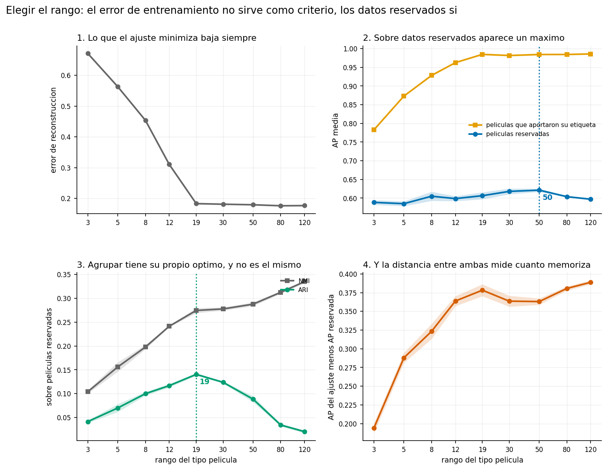
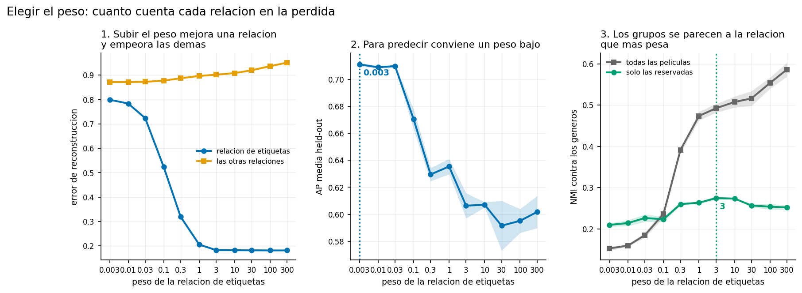
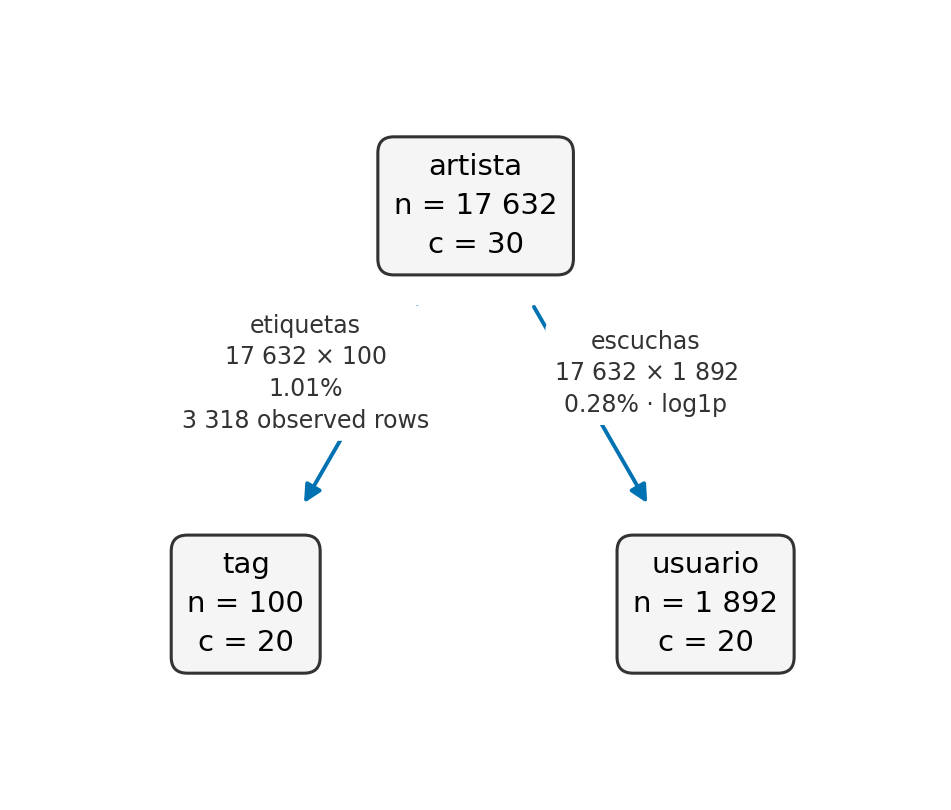

# Qué es

## El problema que resuelve

Tienes varias tablas que conectan distintos tipos de cosas: usuarios con películas,
películas con géneros, películas con actores. Cada tabla es una matriz.

La librería las factoriza **todas a la vez**, compartiendo la representación de cada
tipo. Lo que aprende de una tabla queda disponible para las otras.

El resultado son dos cosas por cada tipo de entidad:

- un **factor**, que dice a qué grupos pertenece cada entidad,
- un **backbone** por cada tabla, que dice cómo se relacionan los grupos de un lado
  con los del otro.

## Los tres términos que aparecen en todo el resto {.smaller}

**Relación.** Una matriz que conecta dos tipos. `(pelicula, genero)` de 3310 x 19 dice
qué géneros tiene cada película.

**Factor** ($G$). Una matriz de (entidades x grupos), no negativa. La fila de una
película dice cuánto pertenece a cada grupo. El grupo asignado es el argmax de esa fila.

**Backbone** ($S$). Una matriz chica de (grupos x grupos), una por relación. Dice cómo
se conectan los grupos de los dos tipos que la relación une.

$$R_{ij} \approx G_i\, S_{ij}\, G_j^T$$

El **rango** de un tipo es cuántos grupos tiene. Es el parámetro que más importa.

## Cuándo sirve y cuándo no {.smaller}

Sirve cuando:

- Hay **varias fuentes** sobre las mismas entidades y quieres que se informen entre sí.
- Las matrices son **dispersas y grandes**, con millones de filas y pocos por ciento de
  densidad. Ahí una implementación que densifica no cabe en memoria.
- Quieres **grupos interpretables**, no solo una predicción.
- Algunas entidades tienen etiqueta y otras no.

No sirve cuando:

- Hay una sola matriz y solo quieres predecir. Un kNN o un modelo supervisado
  directo va a andar igual o mejor, y es más simple.
- Necesitas la mejor precisión posible en una tarea de predicción concreta.

# Cómo se usa

## Ajuste mínimo {.smaller}

```python
from datafiusion import Relation, fuse

relaciones = {
    "ratings": Relation(src="usuario", dst="pelicula", matrix=M_ratings),
    "generos": Relation(src="pelicula", dst="genero", matrix=M_generos),
}
ranks = {"usuario": 15, "pelicula": 10, "genero": 6}

modelo = fuse(relaciones, ranks, max_iter=200, tol=1e-6)

print(modelo.n_iter, modelo.stop_reason)   # 137 tol
print(modelo.rel_error)                    # error por relacion
```

Las matrices son `scipy.sparse`. Los nombres de las relaciones importan: son los que se
usan después para pedir predicciones o proyectar entidades nuevas.

## De DataFrames a relaciones alineadas {.smaller}

Los datos reales suelen venir como tablas largas, no como matrices. El constructor
resuelve el vocabulario de cada tipo una sola vez (unión ordenada de lo que aparece,
o una lista fijada), así que un tipo compartido ocupa las mismas posiciones en todas
las relaciones sin reindexar nada a mano.

```python
from datafiusion import relations_from_frames

relaciones = relations_from_frames({
    "ratings": dict(frame=df_ratings, src="usuario", dst="pelicula", value="nota"),
    "generos": dict(frame=df_generos, src="pelicula", dst="genero"),
})
```

Los pares duplicados se suman (`value=None` cuenta ocurrencias). Los desajustes
fallan nombrando las categorías: `on_unknown` decide qué pasa con una categoría
fuera de un vocabulario fijado (error, agregarla al final, descartar la fila con
aviso) y `on_missing` con una categoría sin observaciones (fila vacía o error).

Para proyectar un lote nuevo, el vocabulario del lado ajustado se fija con el del
modelo: `vocabularies={"pelicula": modelo.index["pelicula"]}`.

## Agrupar entidades {.smaller}

```python
grupos = modelo.factor("pelicula").argmax(axis=1)     # grupo de cada pelicula
tamanos = np.bincount(grupos)

# Que describe a cada grupo, leyendo el backbone hacia el espacio de generos
perfil = modelo.backbone("generos") @ modelo.factor("genero").T
for g in range(modelo.ranks["pelicula"]):
    top = np.argsort(-perfil[g])[:3]
    print(f"grupo {g}: {tamanos[g]} peliculas, generos {[nombres[j] for j in top]}")
```

La segunda parte es la que hace los grupos legibles. En vez de mirar a mano qué tienen
en común los miembros de un grupo, el backbone lo dice: conecta cada grupo de películas
con el espacio de géneros.

Medido en MovieLens: en el 79% de los grupos, el género que el backbone pone primero es
el más frecuente entre los miembros de ese grupo.

## Predecir un atributo {.smaller}

```python
# Distribucion sobre los generos para cada pelicula
proba = modelo.predict_proba(target="genero", views=["generos"],
                             known={"pelicula": indices_peliculas})

# Con muchas entidades, pedir solo los k mejores para no construir la matriz entera
indices, scores = modelo.predict_proba(target="genero", views=["generos"],
                                       known={"pelicula": indices_peliculas},
                                       top_k=3)
```

`views` son las relaciones que se usan como evidencia. Si se pasan varias, se combinan.

Sin `top_k` la salida es de (entidades x niveles del objetivo). Con muchas entidades eso
no cabe, y la llamada levanta `ValueError` en vez de agotar la memoria. Ahí se pasa
`top_k`.

## Entidades nuevas sin reajustar {.smaller}

```python
nuevas = {"generos": Relation(src="pelicula", dst="genero", matrix=M_nuevas)}
derivado = modelo.transform(nuevas, target="pelicula")

derivado.factor("pelicula")                   # factores de las nuevas, no negativos
derivado.predict_proba(target="genero", views=["generos"])
```

Sirve para clasificar entidades que llegaron después, o para ajustar con una muestra y
proyectar millones.

`transform` devuelve **otro modelo**, igual al original salvo por el factor del tipo
proyectado. Por eso se le puede pedir predicciones directamente.

Se encarga solo de reaplicar el escalado que se usó al ajustar. Hacerlo a mano es la
fuente de error más común, y falla en silencio.

## Transformar los valores dentro del modelo {.smaller}

Con conteos sobredispersos, la pérdida cuadrática sobre los valores crudos es la
peor opción medida: las entradas de mayor magnitud dominan el ajuste. La transformación se
declara en la relación y pasa a ser parte del modelo:

```python
Relation(src="usuario", dst="pelicula", matrix=M, preprocess="log1p")
# registro: log1p, sqrt, anscombe, idf; componibles: ("log1p", "idf")
```

`transform` y `loss` reaplican la misma cadena a datos crudos nuevos, y el idf que
usan es el aprendido en el entrenamiento, nunca uno recalculado sobre el lote
nuevo.

Ajustar sobre `log1p(X)` y proyectar `X` crudo era un error sin ningún aviso.
Ahora no puede pasar: el estado viaja con el modelo, se guarda y se recarga.

## Datos parcialmente etiquetados {.smaller}

Si solo algunas entidades tienen etiqueta, hay que decir **cuáles fueron observadas**.
Sin eso, cada cero de la matriz se aprende como un hecho: "esta película no tiene
ningún género".

```python
relaciones["generos"] = Relation(
    src="pelicula", dst="genero", matrix=M_generos,
    rows=indices_etiquetadas,       # el resto no entra a la perdida
)
modelo = fuse(relaciones, ranks=..., max_iter=200, tol=1e-6)
```

Las filas fuera de `rows` no aportan nada al ajuste, y sus factores quedan determinados
por las relaciones que sí se observaron para ellas.

Esto **corrige la semántica, no crea señal**. Si las otras relaciones no distinguen las
clases, enmascarar no las va a hacer aparecer.

## La etiqueta dice algo más que "esta fila existe" {.smaller}

`Relation.rows` decide qué observaciones entran a la pérdida. Pero cuando la etiqueta se
conoce, también dice **en qué componente debe cargar** la entidad. `supervision` usa eso:
una matriz booleana de (entidades x componentes) que declara qué componentes puede
activar cada una. La reconstrucción pasa a ser $(G_i \circ L_i)\, S_{ij}\, G_j^T$,
siguiendo TS-NMF.

```python
permitido = np.ones((n_peliculas, 19), dtype=bool)
permitido[etiquetadas] = Y[etiquetadas] > 0     # solo sus generos

modelo = fuse(relaciones, ranks={"pelicula": 19, ...},
             supervision={"pelicula": permitido})
```

Con esto la componente $j$ **es** el género $j$, en vez de un grupo latente que hay que
traducir leyendo el backbone.

## Anclar cuesta precisión {.smaller}

Sobre las películas reservadas, cuatro semillas:

| | AP held-out | ARI held-out | grupo = género |
|---|---|---|---|
| sin anclaje | 0.605 | 0.141 | 0.061 |
| anclado | 0.546 | 0.105 | **0.242** |
| diferencia | -0.060 | -0.036 | **+0.181** |

Las tres diferencias son significativas. El anclaje cuadruplica la fracción de películas
cuyo grupo coincide directamente con su género, y a cambio predice y agrupa peor: forzar
a las etiquetadas a usar solo sus géneros le quita al modelo la estructura de las otras
relaciones que no se alinea con la etiqueta.

Conviene cuando importa que las componentes tengan un significado fijo. No cuando
importa la precisión.

## En texto pasa lo contrario {.smaller}

MovieLens tiene tres relaciones, y ratings y elenco traen estructura que no se alinea con
el género. 20 Newsgroups tiene una sola relación documento-término, y las categorías sí
corresponden al vocabulario. Ahí el anclaje agrega información en vez de destruirla.

Sobre los documentos **no** supervisados, tres semillas:

| supervisión | ARI | acierto directo |
|---|---|---|
| 0% | 0.185 | 0.036 (azar) |
| 10% | 0.227 (+3.8 SE) | 0.425 |
| 20% | 0.250 (+6.5 SE) | 0.461 |
| 50% | 0.292 (+8.5 SE) | 0.534 |

Referencia: el NMF de `sklearn`, sin agrupar términos, da ARI 0.184 contra 0.185 de la
tri-factorización sin supervisar. Agrupar los términos no cuesta calidad acá.

## La regla que sale de los dos casos {.statement}

**`supervision` conviene cuando la relación supervisada
es la principal fuente de estructura**

No cuando compite con otras que aportan estructura distinta.

## Los mecanismos son independientes {.smaller}

| Mecanismo | Pregunta que responde |
|---|---|
| `Relation.rows` | ¿esta fila fue observada en esta relación? |
| `Relation.entry_weights` | ¿cuánto pesa esta entrada, y qué son los ceros? |
| `supervision` | ¿qué componentes puede activar esta entidad? |
| `empty_rows` | ¿quedó alguna entidad sin observación en ninguna parte? |

Una fila de puros `True` en `supervision` significa "no sé en qué componentes carga",
que no es lo mismo que "no hay datos". Por eso hacen falta los dos.

El último es un aviso, no una entrada: `fuse` levanta un `UserWarning` y deja los
índices en `modelo.empty_rows`. Sin él, esas entidades quedan con el factor de la
inicialización y `argmax` las manda a todas al mismo grupo, inflándolo en silencio.
Pasa cada vez que un filtro aguas arriba deja entidades sin filas.

## Retener entradas para validar {.smaller}

`Relation.rows` opera por fila completa; `entry_weights` baja a la entrada: un peso
por entrada almacenada y un peso de fondo `background` para las no almacenadas.
Peso cero oculta la entrada del ajuste por todas las vías (pérdida, escala e
inicialización, verificado a $10^{-12}$).

```python
pesos, (filas, columnas) = holdout_entries(M, fraction=0.1, random_state=0)
rel = Relation(src="usuario", dst="pelicula", matrix=M, entry_weights=pesos)
modelo = fuse({"ratings": rel}, ranks)
pred = modelo.reconstruct_entries("ratings", filas, columnas)
```

Con eso la curva de validación contra el rango se mide por corrida, sin reservar
entidades completas. Retener el 10% cuesta 1.9x en tiempo.

`background` controla los ceros no almacenados: `1.0` los observa, `0.0` los
ignora, intermedio los lee como negativos débiles (retroalimentación implícita).

## Ajustes largos {.smaller}

```python
parcial = fuse(relaciones, ranks=..., max_iter=500)
parcial.save("modelo/")

# despues, en otra sesion
from datafiusion import FusionModel
modelo = FusionModel.load("modelo/")
final = modelo.resume(relaciones, max_iter=500)   # continua, no reinicia
```

`save` guarda la configuración completa (supervisión, máscaras, grafos,
preprocesamiento y su estado), y `resume` la reaplica, así que reanudar con las
mismas relaciones reproduce las mismas unidades sin repetir nada a mano.

`modelo.history` tiene la pérdida en cada iteración: sirve para ver si ya convergió sin
tener que volver a ajustar con otro `max_iter`.

## Ajustar en GPU {.smaller}

```python
import numpy as np

relaciones = {
    "ratings": Relation(src="usuario", dst="pelicula",
                        matrix=M_ratings.astype(np.float32)),
    "generos": Relation(src="pelicula", dst="genero",
                        matrix=M_generos.astype(np.float32)),
}
modelo = fuse(relaciones, ranks, device="gpu")
modelo.G["pelicula"]   # numpy, igual que con device="cpu"
```

El loop corre en la GPU (cuSPARSE y cuBLAS vía CuPy) y el modelo vuelve en numpy,
así que guardar, `transform` y `predict_proba` no cambian.

Se instala con `uv sync --extra gpu` y requiere un driver NVIDIA con CUDA 13.
Sin GPU no hay nada que instalar: el default `device="cpu"` nunca importa cupy.

Los datos van en `float32` porque en GPUs de consumo el `float64` corre a una
fracción de la velocidad. Sin soporte todavía: relaciones Poisson y pesos por
entrada.

# Glosario de métricas

## Predecir un atributo {.smaller}

**AP media** (*average precision*). El modelo ordena los 19 géneros por score, y AP mira
en qué posiciones quedaron los verdaderos.

Una película cuyos géneros reales son Comedy y Drama, y el modelo pone Comedy primero y
Drama tercero:

| posición | acertó | precisión hasta ahí |
|---|---|---|
| 1 (Comedy) | sí | 1 de 1 = 1.00 |
| 2 | no | |
| 3 (Drama) | sí | 2 de 3 = 0.67 |

AP de esa película = (1.00 + 0.67) / 2 = **0.83**. Se promedia sobre todas.

Va de 0 a 1 y premia poner los verdaderos arriba. Referencia: predecir siempre los
géneros más frecuentes, sin mirar la película, da 0.550. Ese es el piso.

## Dos variantes más simples {.smaller}

**hit@1**. La fracción de películas donde el género de mayor score es uno de los
verdaderos. Fácil de interpretar, pero ignora todo el resto del ranking: da lo mismo si
los otros verdaderos quedaron segundos o últimos.

**R-precision**. Si la película tiene k géneros verdaderos, cuántos de los k primeros
del ranking son correctos, dividido por k. Es AP sin promediar por posición.

Las tres van de 0 a 1 y ordenan casi siempre igual. AP es la que reporto porque usa el
ranking completo.

## Agrupar entidades {.smaller}

Las dos comparan la partición que produjo el modelo contra una partición de referencia,
acá los géneros. Los nombres de los grupos no importan, solo qué queda junto con qué.

**NMI**, *normalized mutual information*, información mutua normalizada. Pregunta: si te
digo en qué grupo del modelo cayó una película, ¿cuánta incertidumbre te quita sobre su
género? Se calcula con entropías y se divide por la entropía promedio de las dos
particiones, para dejarla entre 0 (el grupo no dice nada del género) y 1 (lo determina).

**ARI**, *adjusted rand index*, índice de Rand ajustado. Mira **todos los pares** de
películas y cuenta en cuántos el modelo y la referencia coinciden, ya sea poniéndolas
juntas o separándolas. El "ajustado" descuenta los aciertos que saldrían por azar, de
modo que una partición al azar da 0 en vez de un número positivo. Puede ser negativa.

## Por qué las dos no coinciden {.smaller}

| la partición del modelo es | NMI | ARI |
|---|---|---|
| idéntica a la referencia, con otros nombres | 1.000 | 1.000 |
| la referencia, pero cada grupo partido en dos | 0.775 | 0.429 |
| independiente de la referencia (azar) | 0.000 | -0.333 |

La fila del medio sale de las definiciones. Partir un grupo en dos **no destruye
información**: sabiendo el subgrupo se sigue sabiendo el grupo original, así que la
información mutua casi no baja. Pero sí **rompe pares** que antes estaban juntos, y eso
es exactamente lo que ARI cuenta.

Por eso al barrer el rango decide ARI: pedir más grupos infla el NMI sin que haya más
estructura.

**Coherencia.** Cuántas veces más probable es que dos películas del mismo grupo compartan
un género, comparado con dos películas al azar. 1.0 es el azar, 2.0 es el doble. No
necesita elegir una etiqueta verdadera por película, así que evita esa convención.

## Cómo leer las comparaciones {.smaller}

**Error de reconstrucción relativo.** $\|M - G S G^T\|_F / \|M\|_F$. Vale 0 si la
reconstrucción es exacta y 1 si es tan mala como predecir cero en todas partes. Es lo
que el ajuste minimiza, y por eso **no** sirve como criterio de calidad: siempre se
puede bajar subiendo el rango.

**SE** (error estándar). Cuánto varía el promedio entre repeticiones con distinta
semilla. La banda sombreada de las figuras es un SE hacia cada lado.

Regla que uso en todo el material: una diferencia menor a **2 SE** no se declara como
diferencia. Por eso "+0.177 de NMI (15.7 SE)" es un resultado y "-0.010 de AP (2.7 SE)"
apenas lo es.

# Decisiones

## Qué ruta usar {.smaller}

Hay dos formas de ajustar. `fuse` es la actual; `dfmf_sparse` es la anterior y quedó
congelada para que los resultados ya obtenidos sigan reproduciéndose.

| Si tu objetivo es | Usa | Por qué |
|---|---|---|
| Agrupar entidades | `fuse` | +0.18 de NMI sobre la anterior |
| Predecir un atributo | cualquiera | quedan parejas, la anterior 0.010 de AP arriba |
| Datos parcialmente etiquetados | `fuse` | es la única con máscaras |
| Ajustes de horas | `fuse` | tiene parada por tolerancia y `resume` |
| Reproducir un resultado anterior | `dfmf_sparse` | está congelada y fijada por test |

## {.image}



## Qué mirar en esas cuatro curvas {.smaller}

**1. El error de reconstrucción no decide.** Es lo que el ajuste minimiza, así que baja
siempre al subir el rango. Elegir por ahí lleva al rango más alto que uno tenga
paciencia de correr.

**2. Reservar entidades y medir ahí.** Sobre las películas cuyo género nunca entró al
ajuste aparece un máximo real, en rango 50 para predecir.

**3. Agrupar tiene otro óptimo**, en rango 19, que coincide con el número de géneros.
No hay un rango que sea el mejor para las dos cosas.

**4. La distancia entre las dos curvas del panel 2 mide cuánto memoriza.** Va de 0.19 a
0.39 al subir el rango. Si esa brecha crece y el held-out no mejora, el rango sobra.

```python
reservadas = np.arange(2648, 3310)     # nunca aportan su etiqueta
R["etiquetas"] = Relation(src="pelicula", dst="genero", matrix=Y,
                          rows=np.arange(2648))   # solo estas la aportan
```

## {.image}



## Qué mirar en esas tres curvas {.smaller}

**1. El peso reparte el error.** Subir el de una relación baja su error y sube el de las
otras. Es una decisión sobre a cuál fuente le crees más, no un parámetro que se optimice
solo.

**2. Para predecir hay un óptimo medible.** Acá está en pesos bajos y se aplana: dejar
que las otras relaciones determinen los factores predice mejor el género retenido.

**3. Para agrupar, cuidado con la circularidad.** La curva gris mide el parecido de los
grupos con los géneros usando todas las películas, y sube siempre: subir el peso de una
relación hace que los grupos se parezcan a ella, y medirlo contra esa misma relación
solo confirma lo que uno mismo pidió. La curva verde usa solo las reservadas, y ahí sí
aparece un máximo en 3.

## Tres trampas al evaluar {.smaller}

**Un óptimo pegado al borde de la grilla no es un resultado.** Significa que la grilla
está mal centrada, salvo que la curva ya se haya aplanado ahí. El script lo avisa
distinguiendo los dos casos.

**NMI sube casi siempre al pedir más grupos**, aunque no haya más estructura. Sobre las
películas reservadas, NMI dice que el mejor rango es 120 y ARI dice que es 19. ARI
corrige por azar, así que es la que decide.

**Medir contra la relación cuyo peso se está barriendo es circular.** Siempre premia
subirlo.

```python
from sklearn.metrics import adjusted_rand_score
grupos = modelo.factor("pelicula").argmax(axis=1)
adjusted_rand_score(verdad[reservadas], grupos[reservadas])
```

Todo esto sale de `examples/movielens/curvas.py`, que genera las dos figuras.

# Conteos

## Tres experimentos con criterio declarado {.smaller}

Los conteos (viajes, reproducciones, palabras) son sobredispersos: en Last.fm la
varianza de las reproducciones es 18 883 veces la media. La pregunta fue si
conviene transformarlos bajo la pérdida cuadrática o modelarlos con su likelihood:

```python
Relation(src="artista", dst="usuario", matrix=escuchas, family="poisson")
```

La familia se declara por relación y se mezcla con relaciones gaussianas en el
mismo ajuste, compartiendo factores. El criterio de cada experimento se declaró
antes de correr: ganar por 2 SE.

## Transformar gana a modelar {.smaller}

Agrupar 20 Newsgroups contra sus categorías (ARI, 3 semillas):

| variante | ARI |
|---|---|
| cuadrática, conteos crudos | 0.026 |
| Poisson, conteos crudos | 0.113 |
| cuadrática, log1p | 0.114 |
| Poisson, idf | 0.151 |
| cuadrática, TF-IDF | **0.185** |
| Poisson sobre TF-IDF | degenera (0.000) |

La likelihood incorpora por construcción la corrección que la transformación
hace a mano, y da el mismo resultado (0.113 contra 0.114). El reponderado por
idf mejora bajo ambas pérdidas, así que el efecto viene del reponderado y no de
la forma de la pérdida. KL sobre datos normalizados por fila degenera, porque la
KL modela masa y la normalización la elimina.

## {.image}



## Familias mezcladas en Last.fm {.smaller}

La figura anterior es el esquema del caso, dibujado con `fusion_diagram`. La
tarea: predecir los tags retenidos de cada artista, 4 semillas apareadas.

| | AP en prueba |
|---|---|
| baseline de popularidad | 0.204 |
| mezclado (Poisson + gaussiana) | 0.265 |
| monofamilia (log1p) | **0.314** |

El brazo mezclado pierde por 2.9 SE.

La primera corrida además encontró un defecto real, ya corregido: sin calibrar
el gradiente KL por su desviación nula, la relación de conteos domina
numéricamente a la gaussiana y el peso entre familias no tiene ningún efecto.
El síntoma fue una curva de validación plana: los cuatro pesos daban lo mismo.

## La conclusión de los conteos {.statement}

**Cuando hay conteos, es mejor usar log1p**

La familia Poisson queda para cuando el modelo de conteo se necesita
por sus propiedades, no para mejorar la precisión.

# Errores que cuestan caro

## Cuatro cosas que fallan en silencio {.smaller}

**Validar con entidades que entraron al ajuste.** Da 0.98 de AP, y 1.00 exacto si el
rango iguala el número de clases. No mide nada. Siempre reservar entidades.

**Usar `lambda_G`.** No funciona: matemáticamente la penalización no tiene punto fijo, y
lleva los factores a cero. Queda en 0 por defecto. Para regularizar, bajar el rango.

**Comparar dos ajustes con inicializaciones distintas.** El inicializador pesa más que
casi todo lo demás: `nndsvd` contra `random` son 0.25 de AP de diferencia, más que
cualquier decisión de modelo.

**Reescalar o transformar a mano las matrices al proyectar entidades nuevas.** Usar
la norma, el idf o la transformación del lote nuevo en vez de los del ajuste da
factores equivocados sin ningún aviso. `transform` reaplica escala, pesos y
`preprocess` solo.

## Lo que ahora falla con error en vez de en silencio {.smaller}

Una revisión adversarial del código encontró estos casos; todos tienen test.

- Nombres de relación o tipo que no sirven como nombre de archivo (se usan en
  `save`) se rechazan al construir.
- `save` sobre un directorio ya usado lo limpia primero: antes, la configuración
  de un modelo anterior se volvía a leer por sobre el `null` de `meta.json`.
- Los escalares de numpy (`np.float32`, `np.int64`) en los hiperparámetros ya no
  desaparecen de la metadata guardada.
- `resume` de un modelo derivado por `transform` se rechaza: sus factores son de
  otras entidades y el warm start corría sin aviso.
- Declarar un `preprocess` distinto al del ajuste al proyectar se rechaza.
- Las máscaras con duplicados se deduplican (el resultado dependía del tamaño de
  bloque) y una máscara entera vacía ya no crashea.

## Cómo medir memoria sin engañarse {.smaller}

`resource.getrusage(...).ru_maxrss` es un **máximo histórico del proceso completo**.
Restarle el RSS actual le atribuye a la etapa que estás midiendo todo lo que el proceso
reservó antes.

Ese error hizo que una etapa pareciera usar 10 GB cuando usaba 2 GB.

::: warning
Medir como `pico_despues - pico_antes`, generar los datos de prueba en otro proceso, y
sospechar cuando dos implementaciones distintas reportan el mismo número al megabyte.
:::

# Qué esperar

## Costo {.smaller}

Contra `scikit-fusion`, que es la implementación de referencia y densifica las
matrices, sobre el mismo problema y con la misma inicialización:

| Configuración | data-fiusion | scikit-fusion |
|---|---|---|
| 3310 x 6 567 | 0.5 s, 33 MB | 1.4 s, 319 MB |
| 3310 x 29 776 | 1.1 s, 123 MB | 5.8 s, 1 247 MB |
| 3310 x 108 536 | 5.8 s, 386 MB | 23.5 s, 4 031 MB |

Entre 2.7 y 5.2 veces más rápido, y alrededor de 10 veces menos memoria. El modelo que
produce es el mismo: con la misma inicialización, 0.476 contra 0.442 de AP, que es la
diferencia esperable entre dos generadores aleatorios.

## El loop de ajuste quedó entre 10 y 14 veces más rápido {.smaller}

Tres cambios acumulables sobre la misma instancia, semilla y 10 iteraciones, medidos
contra la ruta anterior en CPU y `float64`. La pérdida final coincide a 6 decimales en
las cuatro configuraciones, así que las cuatro producen el mismo ajuste.

- **Caché de productos.** El loop hacía cuatro pasadas sparse por relación e
  iteración donde bastan dos: el producto $M G_{dst}$ ahora se calcula una vez,
  dentro de la pérdida, y el solve de $S$ y la acumulación siguiente lo
  reutilizan. 1.3x, con trayectoria bit a bit idéntica.
- **float32.** Con los datos en `float32`, los factores y buffers siguen esa
  precisión y la pérdida se acumula en `float64`. La mitad de memoria en
  factores y entre 1.8x y 2.0x acumulado.
- **GPU.** `device="gpu"` corre el loop en cuSPARSE y cuBLAS. 10.5x acumulado en
  la instancia chica y 13.8x en la grande. Como referencia, el techo medido de
  paralelizar el loop en CPU es 3x.

## Calidad al agrupar {.smaller}

Agrupando películas en 19 grupos, contra los géneros como referencia:

| método | NMI | ARI |
|---|---|---|
| k-means sobre las mismas matrices | 0.083 | 0.015 |
| `dfmf_sparse` | 0.579 | 0.464 |
| `fuse` | **0.756** | **0.741** |

NMI y ARI van de 0 (azar) a 1 (partición idéntica). La factorización agrupa mucho mejor
que k-means sobre los mismos datos, que es el punto de usarla.

Advertencia: la relación de géneros entra al ajuste, así que recuperar géneros es en
parte tautológico. Sin esa relación, el NMI baja a 0.140, todavía sobre k-means.

## Calidad al predecir {.smaller}

Predecir los géneros de películas que el modelo nunca vio:

| método | AP media |
|---|---|
| baseline marginal | 0.550 |
| solo ratings | 0.678 |
| solo elenco | 0.621 |
| **las dos fuentes juntas** | **0.718** |
| kNN por coseno sobre las mismas matrices | 0.749 |

Fusionar aporta sobre cada fuente por separado, que es la afirmación central del
modelo. Pero para esta tarea concreta un kNN queda 0.03 arriba.

Si lo único que necesitas es predecir un atributo desde una matriz, empieza por el kNN.

# Qué falta

## Pendientes, en orden de utilidad {.smaller}

**Sincronizaciones del loop GPU.** La suma de los kernels de una iteración
proyecta 38x contra CPU y el ajuste completo da 7.6x; la brecha son lanzamientos
y sincronizaciones por iteración. El paso siguiente es acumular la pérdida en el
dispositivo y bajarla cada tantas iteraciones.

**Parada temprana por error de validación.** Las entradas retenidas ya se pueden
puntuar; falta engancharlas al loop de ajuste.

**`transform` bajo Poisson**, y máscaras o pesos por entrada sobre la relación
Poisson misma. Poisson y los pesos por entrada tampoco corren en GPU.

**La brecha de 1.6% entre las dos rutas**, con su sospechoso anotado.

`docs/oportunidades.md` tiene el detalle, incluido lo que ya se probó y no funcionó,
para no repetirlo.

## Dónde mirar

| Quiero | Archivo |
|---|---|
| Usar la librería, por tarea | `docs/guia-de-uso.md` |
| La API completa | `README.md` |
| Un caso completo con verdad de referencia | `examples/movielens/README.md` |
| Semi-supervisión y conteos en texto | `examples/newsgroups/README.md` |
| Familias mezcladas con datos reales | `examples/lastfm/README.md` |
| Ajustar en GPU, con los tiempos medidos | `examples/gpu/README.md` |
| Saber qué falta y qué se descartó | `docs/oportunidades.md` |
| Por qué cada palanca es como es | docstring de `fuse` |

Los fragmentos de la guía son plantillas sobre un dominio de ejemplo. Los números de
calidad y de costo contra `scikit-fusion` salen de los scripts de `examples/`; los de
la tabla de aceleración acumulada se midieron aparte, sobre la instancia sintética que
describe la misma slide.
